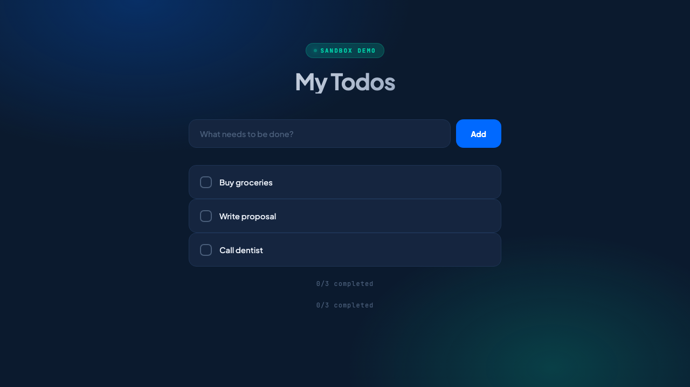
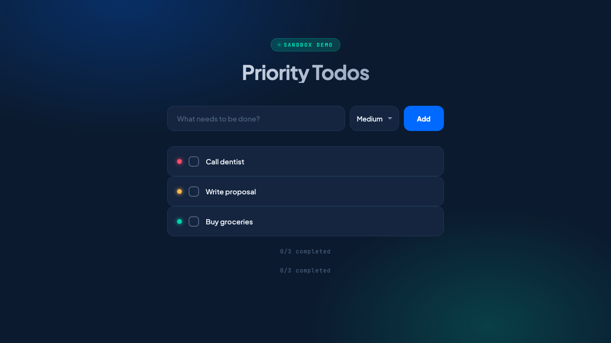
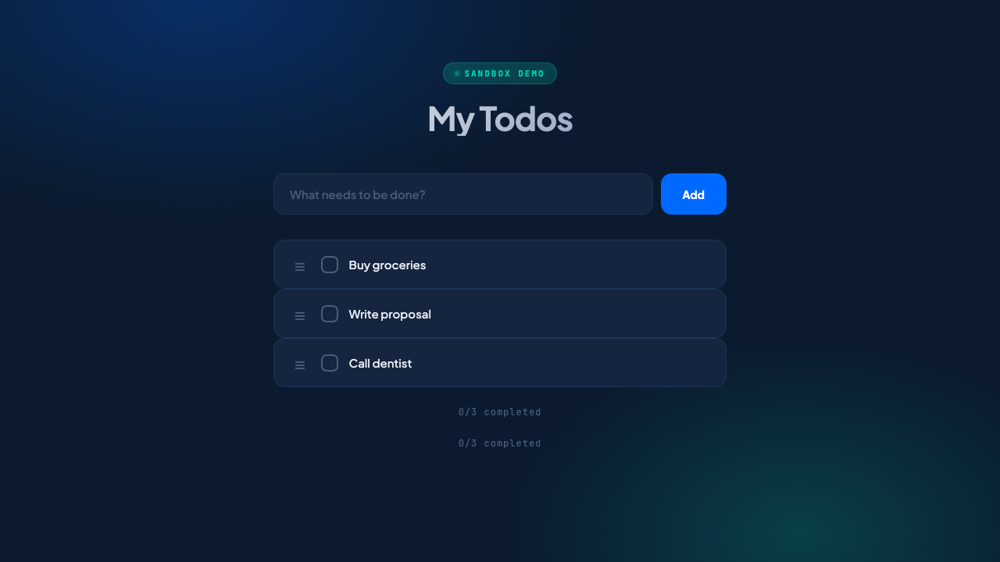
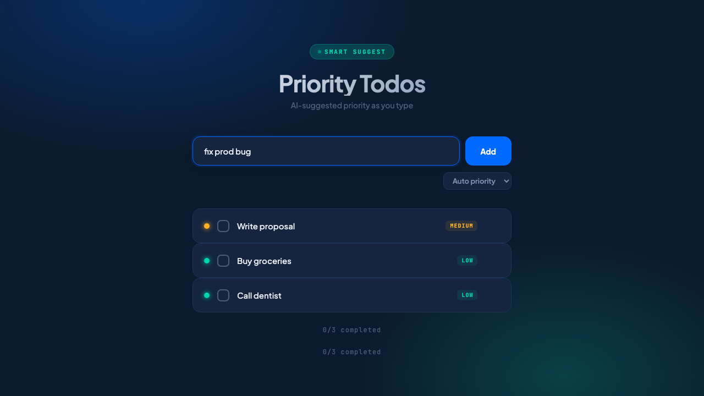
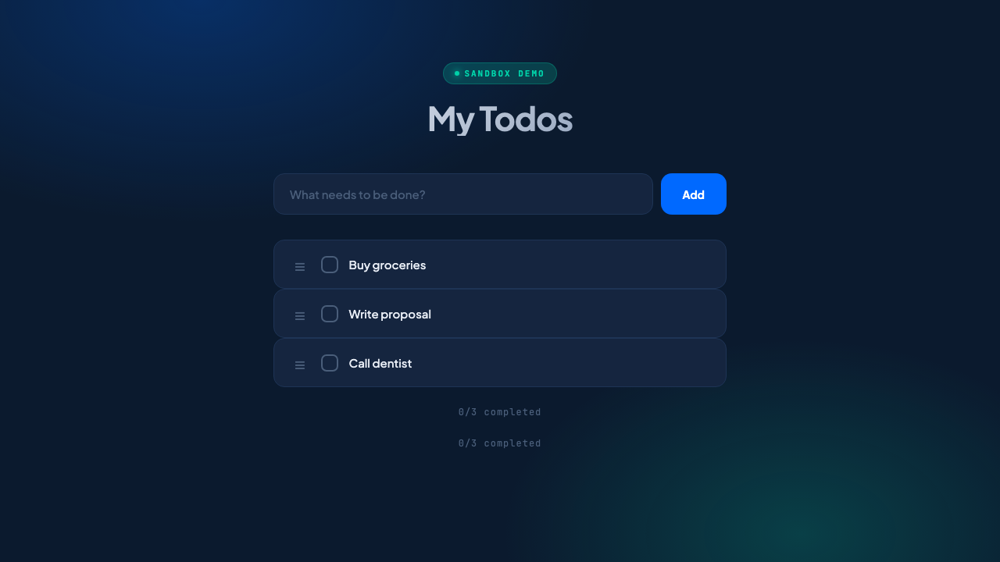

# Sandbox Demo: Snapshot, Fork, Preview

Demo application for DigitalOcean's Deploy conference showcasing the [do-app-sandbox](https://github.com/digitalocean-labs/do-app-sandbox) SDK's snapshot/fork/preview workflow.

## What's Inside

A **Flask + HTMX todo app** with 3 feature variants, demonstrating how an AI agent can deploy multiple implementations as live previews for a product manager to choose from.

| File | Description |
|------|-------------|
| `app.py` | Base todo app — clean UI, add/toggle/delete todos |
| `variants/priority_color_badges.py` | Adds colored priority dots (red/yellow/green) |
| `variants/priority_drag_reorder.py` | Adds drag-to-reorder with SortableJS |
| `variants/priority_smart_suggest.py` | Suggests priority from text keywords |
| `demo_runner.py` | Interactive demo script (create -> snapshot -> fork -> preview) |
| `deploy_live.py` | Non-interactive deployment script |
| `benchmark_warmpool.py` | Cold start vs warm pool timing benchmark |

## Quick Start (Local)

```bash
python3 -m venv .venv && source .venv/bin/activate
pip install flask
python app.py  # http://localhost:8080
```

Try each variant:
```bash
python variants/priority_color_badges.py
python variants/priority_drag_reorder.py
python variants/priority_smart_suggest.py
```

## Deploy to App Platform

### Prerequisites

- [doctl](https://docs.digitalocean.com/reference/doctl/) installed and authenticated (`doctl auth init`)
- `pip install do-app-sandbox`
- DO Spaces bucket for snapshots (create with `aws s3api create-bucket --bucket <name> --endpoint-url https://nyc3.digitaloceanspaces.com`)
- Spaces credentials as env vars:

```bash
export SPACES_ACCESS_KEY="..."
export SPACES_SECRET_KEY="..."
export SPACES_BUCKET="your-bucket"
export SPACES_REGION="nyc3"
```

> **Note:** The SDK uses doctl's own authentication -- no `DIGITALOCEAN_TOKEN` env var needed.

### Run the Demo

```bash
# Full interactive demo (create -> snapshot -> fork 3 -> pick winner)
python demo_runner.py

# Or pre-create snapshot, then run from it live
python demo_runner.py --pre-snapshot
python demo_runner.py --from-snapshot <snapshot_id>

# Non-interactive deployment
python deploy_live.py
```

### What happens:

1. **Base app** is deployed to a sandbox on App Platform (~35s)
2. **Snapshot** archives the app + dependencies to DO Spaces (~3s)
3. **Fork x3** restores the snapshot to 3 new sandboxes in parallel
4. Each sandbox gets a **different variant** uploaded and started
5. All 3 get **public HTTPS URLs** -- open side by side, PM picks the winner

## Cold Start vs Warm Pool

The `benchmark_warmpool.py` script measures both deployment strategies:

```bash
python benchmark_warmpool.py
```

| Phase | Cold Start | Warm Pool |
|-------|-----------|-----------|
| Container ready | 34.6s | **0.7s** (50x faster) |
| Snapshot restore | 2.9s | 2.7s |
| App startup | 4.6s | 4.6s |
| **Total** | **42.1s** | **~8s** |

The warm pool uses `SandboxManager` to maintain pre-created sandboxes. When you acquire from the pool, the container is already running -- you just restore the snapshot and start the app.

```python
from do_app_sandbox import SandboxManager, PoolConfig

manager = SandboxManager(
    pools={"python": PoolConfig(target_ready=3, max_ready=3)},
)
await manager.start()
sandbox = await manager.acquire(image="python")  # <1s from pool
```

## Screenshots

| Base App | Color Badges | Drag Reorder | Smart Suggest |
|----------|-------------|-------------|--------------|
|  |  |  |  |

### Live on App Platform

| Base App | Color Badges | Drag Reorder | Smart Suggest |
|----------|-------------|-------------|--------------|
|  |  |  |  |

## License

MIT
